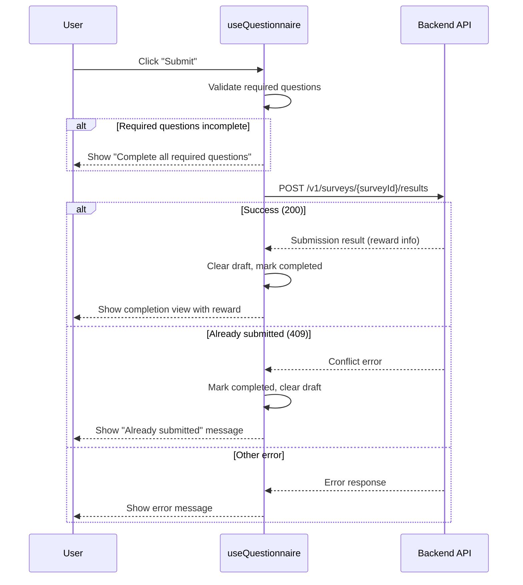

# Questionnaire System

:::info
The questionnaire system provides a full survey/questionnaire interface within the eIsland dynamic island. It supports multiple question types, draft persistence, multi-questionnaire navigation, authenticated submission, and optional Pro membership rewards. For the state machine entry, see [State Machine — questionnaire](states.md#questionnaire).
:::

## Overview

The questionnaire system is a self-contained feature that allows administrators to publish surveys and users to fill them out directly inside the island. The system is designed around three principles:

- **Draft safety** — answers auto-save every 250ms, so no work is lost on crash or disconnect.
- **Multi-questionnaire support** — multiple active surveys are presented in a sidebar list, each with independent answers.
- **Reward integration** — completing a questionnaire can grant Pro membership days, displayed on the completion screen.

## Module Structure

:::details Questionnaire module file tree
```
questionnaire/
├── index.ts                              # Module entry point, re-exports QuestionnaireContent
├── QuestionnaireContent.tsx              # Main UI: loading, ready, completed, empty views
├── components/
│   └── QuestionnaireQuestion.tsx         # Individual question renderer (rating, choice, text)
├── hooks/
│   ├── useQuestionnaire.ts              # Data hook: load, draft, submit, multi-questionnaire
│   └── useQuestionnaireNavigation.ts    # Scroll sync and active question tracking
└── utils/
    └── questionnaireAnswers.ts          # Answer validation helpers
```
:::

### File Responsibilities

| File | Responsibility |
|------|---------------|
| `QuestionnaireContent.tsx` | Top-level component; switches between loading, empty, ready, and completed views |
| `QuestionnaireQuestion.tsx` | Renders a single question based on its type (rating, single_choice, multiple_choice, text) |
| `useQuestionnaire.ts` | Core business logic: fetches surveys, manages answers, drafts, and submission |
| `useQuestionnaireNavigation.ts` | Scroll-based question index tracking via IntersectionObserver |
| `questionnaireAnswers.ts` | Validates whether all required questions are answered |

## Question Types

:::tip
The questionnaire system supports four question types. Each question has an `id`, `title`, `type`, `required` flag (defaults to `true`), and type-specific options.
:::

| Type | Answer Shape | UI Control | Constraints |
|------|-------------|------------|-------------|
| `rating` | `number` | Grid of buttons (e.g., 0–5) | `min` and `max` define the range |
| `single_choice` | `string` | Radio button labels | `options` array of strings |
| `multiple_choice` | `string[]` | Checkbox labels | `options` array; toggling adds/removes from array |
| `text` | `string` | Textarea | `maxLength` defaults to 2000; character counter shown |

## State Management

:::info
The questionnaire does **not** have its own Zustand slice. All business logic state lives inside the `useQuestionnaire` hook as React component-local state. The only global integration is the `setQuestionnaire()` action in `islandSlice`, which transitions the island to the `questionnaire` state (860×400 px).
:::

### Hook State (`useQuestionnaire`)

| State Variable | Type | Description |
|---------------|------|-------------|
| `questionnaires` | `QuestionnaireData[]` | All active, non-completed questionnaires |
| `selectedQuestionnaireId` | `number \| null` | Currently viewed questionnaire |
| `answersByQuestionnaire` | `Record<number, Record<string, QuestionnaireAnswer>>` | Answers keyed by survey ID, then question ID |
| `token` | `string \| null` | JWT from `readLocalToken()`, kept in sync via session listener |
| `viewState` | `QuestionnaireViewState` | One of `loading`, `ready`, `empty`, `completed` |
| `submitting` | `boolean` | Whether a submission request is in flight |
| `submission` | `QuestionnaireSubmissionData \| null` | Result data after successful submission |

## Draft Persistence

:::important
Drafts are auto-saved to localStorage every 250ms (debounced) whenever answers change. Users can also manually trigger a save via the "Save draft" button.
:::

### LocalStorage Keys

| Key Pattern | Value | Purpose |
|-------------|-------|---------|
| `questionnaire-draft:{surveyId}` | JSON `{ surveyId, answers, savedAt }` | Persists partially-filled answers |
| `questionnaire-completed:{surveyId}` | `"true"` | Marks questionnaire as submitted on this device |
| `questionnaire-dismissed:{surveyId}` | `"true"` | Marks the announcement banner reminder as dismissed |

### Draft Lifecycle

1. **Load** — on mount, `readQuestionnaireDraft(surveyId)` restores any existing draft for each active questionnaire.
2. **Auto-save** — a `useEffect` debounces writes to localStorage every 250ms when `answers` changes.
3. **Manual save** — the "Save draft" button calls `writeQuestionnaireDraft()` directly.
4. **Clear on submit** — after successful submission, `clearQuestionnaireDraft()` removes the draft key.
5. **Clear on delete** — `clearQuestionnaireLocalState()` removes all three keys for a given surveyId.

## Submission Flow

:::warning
Submission requires authentication. If the user is not logged in, the submit button is disabled and a "Sign in to submit" message is shown. Drafts can still be saved without authentication.
:::

### Flow Diagram



### Post-Submission

- If multiple questionnaires remain, a "Continue to next" button removes the completed one and auto-selects the next.
- If only one questionnaire existed, the island returns to the hover/idle state.
- The completion view displays reward info (Pro days granted and new expiration date) if configured.

## Multi-Questionnaire Navigation

:::tip
When multiple active questionnaires exist, a sidebar list appears on the left. Each questionnaire maintains its own independent answer set. The sidebar can be collapsed or expanded via a toggle button.
:::

| Feature | Behavior |
|---------|----------|
| **Sidebar list** | Shows all active questionnaires with title and end date |
| **Active indicator** | Blue left-border highlights the currently viewed questionnaire |
| **Independent answers** | Each questionnaire stores answers in `answersByQuestionnaire[surveyId]` |
| **Collapse toggle** | Sidebar can be hidden/shown; state stored in local `listExpanded` |
| **Auto-advance** | After submitting one, `continueAfterSubmission()` selects the next available |

## Navigation (Scroll Sync)

The `useQuestionnaireNavigation` hook provides scroll-to-question synchronization:

| Feature | Implementation |
|---------|---------------|
| **Active tracking** | IntersectionObserver with `rootMargin: '-10% 0px -80% 0px'` |
| **Programmatic scroll** | `scrollToQuestion(index)` smooth-scrolls and suppresses observer for 600ms |
| **Bottom detection** | Separate scroll listener sets `activeIndex` to last question when scrolled to bottom |
| **Reset on switch** | Resets to index 0 and scrolls to top when `questionnaireId` changes |

### Table of Contents (TOC)

A right-side dot-grid navigation shows completion status per question:

| Indicator | Meaning |
|-----------|---------|
| Blue fill | Question has been answered |
| Ring outline | Currently active (visible) question |
| Empty dot | Unanswered question |

## API Endpoints

| Function | Method | Endpoint | Auth | Purpose |
|----------|--------|----------|------|---------|
| `fetchActiveQuestionnaires` | GET | `/v1/surveys/active` | Optional | Get all currently active questionnaires |
| `fetchActiveQuestionnaires` (fallback) | GET | `/v1/surveys/current` | Optional | Legacy single-questionnaire endpoint |
| `fetchQuestionnaireHistory` | GET | `/v1/surveys/my/results` | Required | Get past submission records |
| `deleteQuestionnaireHistory` | DELETE | `/v1/surveys/my/results/{resultId}` | Required | Delete a specific submission record |
| `submitQuestionnaire` | POST | `/v1/surveys/{surveyId}/results` | Required | Submit answers |

:::note
The `fetchActiveQuestionnaires` function tries `/v1/surveys/active` first and falls back to `/v1/surveys/current` for backward compatibility with older server versions.
:::

## Questionnaire Banner

:::info
A banner component in the announcement view reminds users about unfinished questionnaires. It fetches active surveys, filters out completed and dismissed ones, and shows a count with action buttons.
:::

### Banner Behavior

| Action | Effect |
|--------|--------|
| **"Fill them out"** | Transitions the island to the `questionnaire` state |
| **"Ignore current"** | Calls `dismissQuestionnaireReminder()` and removes the survey from the banner list |

The banner hook (`useAnnouncementQuestionnaire`) re-fetches on mount and respects both completion and dismiss markers in localStorage.

## Reward System

:::tip
Questionnaires can optionally grant Pro membership days via the `rewardProDays` field. The reward info is displayed in two places: the reward banner during filling and the completion screen after submission.
:::

| Display Location | Content |
|-----------------|---------|
| **Reward banner** (during filling) | "Complete this questionnaire to get N day(s) of Pro" |
| **Completion screen** | Days granted + new expiration date |
| **No reward configured** | "This questionnaire has no Pro reward" |

## Validation

The `questionnaireAnswers.ts` utility provides validation helpers:

| Function | Description |
|----------|-------------|
| `areRequiredQuestionsComplete(questions, answers)` | Returns `true` if all required questions have non-empty answers |
| Empty check for `rating` | Answer must be a number (not `undefined`) |
| Empty check for `single_choice` | Answer must be a non-empty string |
| Empty check for `multiple_choice` | Answer must be a non-empty array |
| Empty check for `text` | Answer must be a non-empty string |

:::warning
Validation only checks required questions. Optional questions with empty answers do not block submission.
:::

## Error Handling

| Scenario | Behavior |
|----------|----------|
| Malformed server response | Defensive normalization filters out invalid questions silently |
| Invalid JSON in `contentJson` / `answersJson` | Parsed with try-catch; empty fallback on failure |
| Duplicate questionnaire IDs | Filtered to keep only the first occurrence |
| HTTP 409 on submit | Treated as "already submitted"; marks completed locally |
| Network error on load | Shows retry button with error message |
| Network error on submit | Shows error code and message; answers preserved |

## Settings History

:::note
Past questionnaire submissions are viewable in Settings → User → Questionnaire Records. The history page uses the same `QuestionnaireQuestion` component in read-only mode (`readOnly` prop) to display previously submitted answers.
:::

| Feature | Description |
|---------|-------------|
| **View answers** | Expandable detail view of submitted answers |
| **Delete submission** | DELETE request + clears all local state for that survey |
| **Re-submit warning** | After deletion, user may re-submit but will not receive another reward |
